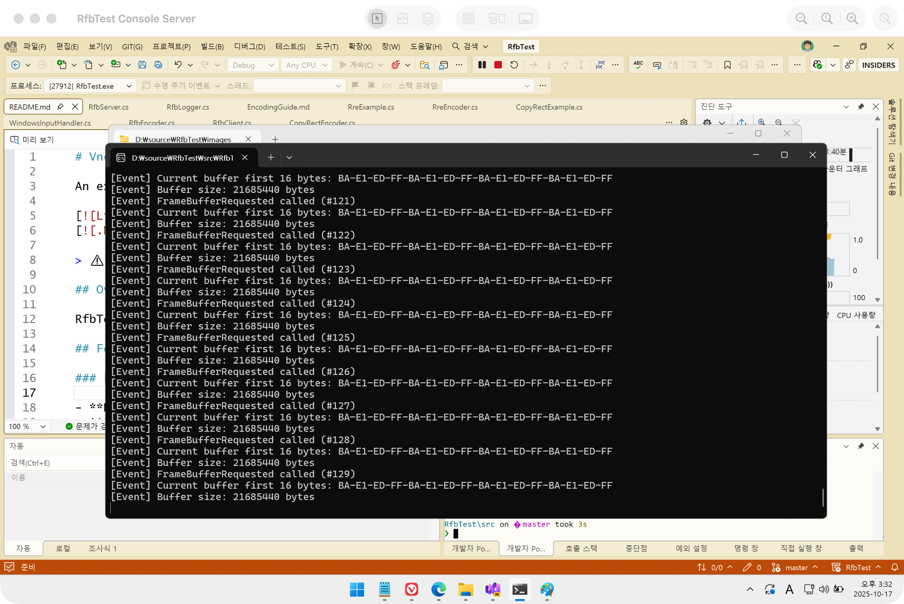
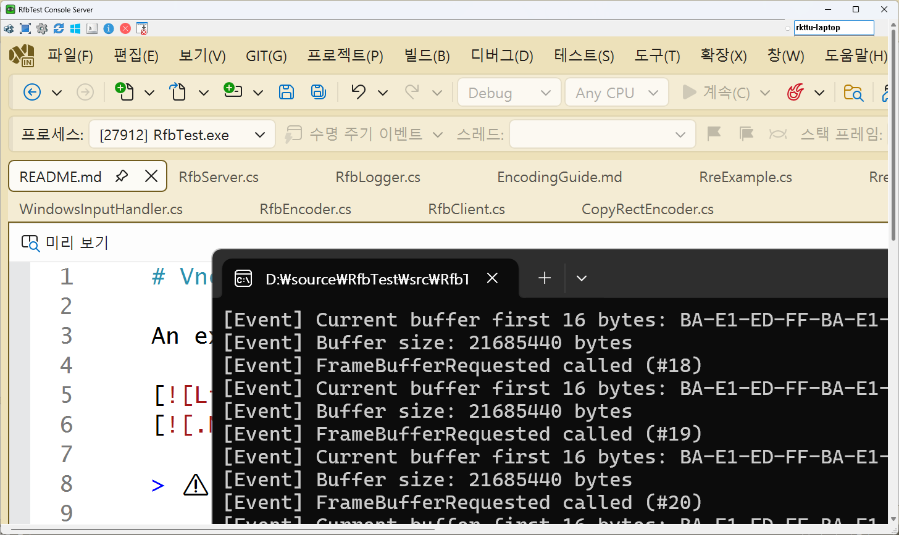

# VncSharp (Experimental RFB Server in C#)





An experimental Remote Framebuffer (RFB) Protocol server implementation in C# targeting .NET 8, exploring efficient screen sharing and remote desktop functionality.

[](LICENSE)
[](https://dotnet.microsoft.com/download/dotnet/8.0)

> ⚠️ **Experimental Project**: This is a work-in-progress implementation of the RFB protocol. Several critical encodings and features are still under development. Contributions are welcome!

> 🤖 **AI-Assisted Development**: This project was developed with the assistance of **GitHub Copilot**, **Anthropic Claude 3.5**, and **Visual Studio 2026**, demonstrating the potential of AI-powered development tools in creating complex protocol implementations.

## Overview

RfbTest is an experimental VNC (Virtual Network Computing) server/client implementation that explores various framebuffer encoding techniques for efficient remote desktop streaming. The project leverages DirectX for screen capture and implements multiple RFB protocol encodings.

## Features

### ✅ Implemented Encodings

- **Raw Encoding**: Basic uncompressed pixel data transfer
- **CopyRect Encoding**: Highly efficient region duplication (99.99% compression for moved content)
- **RRE (Rise-and-Run-length Encoding)**: Optimized for simple UI with solid color regions (90-99% compression)
- **Hextile Encoding**: Tile-based encoding for general desktop content (50-80% compression)

### 🚧 Missing Critical Implementations (Help Needed!)

We're actively seeking contributions for the following high-priority features:

#### Priority 1: ZRLE Encoding ⭐⭐⭐⭐⭐
- **Status**: Not implemented
- **Why it matters**: Best compression ratio, widely supported by modern VNC clients
- **Benefits**: 80-95% compression with zlib + RLE combination
- **Ideal for**: Bandwidth-constrained scenarios, remote work environments

#### Priority 2: Tight Encoding ⭐⭐⭐⭐
- **Status**: Not implemented
- **Why it matters**: Industry standard for image optimization (TightVNC)
- **Benefits**: JPEG + Zlib combination, excellent for photo/video content
- **Ideal for**: Multimedia applications, complex graphics

#### Priority 3: Cursor Pseudo-encoding ⭐⭐⭐
- **Status**: Not implemented
- **Why it matters**: Significantly reduces network traffic for cursor movements
- **Benefits**: Client-side cursor rendering, smoother user experience
- **Ideal for**: Low-latency interactions, reducing server load

### 🔧 Core Components

- **RfbServer**: Main server implementation handling client connections
- **RfbClient**: Client connection management and protocol negotiation
- **RfbEncoder**: Base encoder interface and encoding strategy
- **RfbLogger**: Diagnostic logging for protocol debugging
- **WindowsInputHandler**: Input event processing for remote control

### 📚 Documentation

- Comprehensive encoding guide in `Docs/EncodingGuide.md` (Korean)
- Working examples for RRE and CopyRect encodings
- Performance benchmarks and encoding selection strategies

## Technology Stack

- **.NET 8.0** (Windows)
- **SharpDX**: DirectX 11 screen capture
- **System.Drawing.Common**: Image processing

## Getting Started

### Prerequisites

- .NET 8.0 SDK or later
- Windows OS (for DirectX screen capture)
- Visual Studio 2022 or later (recommended)

### Building the Project

```bash
git clone https://github.com/rkttu/VncSharp.git
cd RfbTest/src
dotnet build
```

### Running the Server

```bash
cd RfbTest
dotnet run
```

## Project Structure

```
RfbTest/
├── Protocol/          # RFB protocol core (RfbServer, RfbClient)
├── Encoders/          # Encoding implementations (Raw, RRE, Hextile, CopyRect)
├── InputHandlers/     # Input event processing
├── Diagnostics/       # Logging and debugging tools
├── Examples/          # Working code examples
└── Docs/             # Documentation and guides
```

## Encoding Performance Comparison

| Encoding | Compression | Speed | Best Use Case |
|----------|-------------|-------|---------------|
| **CopyRect** | 99.99% | Very Fast | Window dragging, scrolling |
| **RRE** | 90-99% | Fast | Simple UI, dialog boxes |
| **Hextile** | 50-80% | Medium | General desktop content |
| **Raw** | 0% | Very Fast | Fallback, incompressible content |
| **ZRLE** ⚠️ | 80-95% | Medium | ❌ Not yet implemented |
| **Tight** ⚠️ | 70-90% | Medium | ❌ Not yet implemented |

## How You Can Help

This is an experimental project, and we need your help! Here's how you can contribute:

### 🎯 High-Priority Contributions

1. **ZRLE Encoder Implementation**
   - Implement zlib compression with RLE algorithm
   - Reference: [RFB Protocol 3.8 Specification](https://github.com/rfbproto/rfbproto/blob/master/rfbproto.rst#zrle-encoding)

2. **Tight Encoding Implementation**
   - JPEG compression for gradients
   - Zlib compression for palettized data
   - Reference: [TightVNC Encoding Specification](https://github.com/TigerVNC/tigervnc/blob/master/common/rfb/tightEncode.cxx)

3. **Cursor Pseudo-encoding**
   - Client-side cursor shape updates
   - Cursor position tracking optimization

### 🐛 Other Ways to Contribute

- Bug fixes and stability improvements
- Performance optimizations
- Documentation enhancements
- Cross-platform support (Linux, macOS)
- Unit tests and integration tests
- Protocol compliance verification

### Contributing Guidelines

1. Fork the repository
2. Create a feature branch (`git checkout -b feature/zrle-encoding`)
3. Commit your changes with clear messages
4. Push to your fork and submit a Pull Request
5. Ensure your code follows existing patterns and includes appropriate error handling

## Known Limitations

- Windows-only (DirectX dependency)
- Missing ZRLE, Tight, and Cursor pseudo-encodings
- Limited authentication methods
- No encryption layer (consider SSH tunneling)
- Experimental stability

## Roadmap

- [ ] ZRLE encoding implementation
- [ ] Tight encoding implementation
- [ ] Cursor pseudo-encoding
- [ ] Enhanced security (VeNCrypt, TLS)
- [ ] Cross-platform screen capture
- [ ] Performance profiling and optimization
- [ ] Comprehensive test suite
- [ ] Multi-client support improvements

## References

- [RFB Protocol Specification](https://github.com/rfbproto/rfbproto)
- [TigerVNC Implementation](https://github.com/TigerVNC/tigervnc)
- [RealVNC Documentation](https://www.realvnc.com/en/connect/docs/)
- [LibVNCServer Project](https://libvnc.github.io/)

## License

This project is licensed under the **Apache License 2.0** - see the [LICENSE](LICENSE) file for details.

```
Copyright 2024 RfbTest Contributors

Licensed under the Apache License, Version 2.0 (the "License");
you may not use this file except in compliance with the License.
You may obtain a copy of the License at

    http://www.apache.org/licenses/LICENSE-2.0

Unless required by applicable law or agreed to in writing, software
distributed under the License is distributed on an "AS IS" BASIS,
WITHOUT WARRANTIES OR CONDITIONS OF ANY KIND, either express or implied.
See the License for the specific language governing permissions and
limitations under the License.
```

## Acknowledgments

- Thanks to the VNC and RFB protocol community
- SharpDX contributors for DirectX interop
- All contributors and testers of this experimental project

## Contact

- **Repository**: [https://github.com/rkttu/VncSharp](https://github.com/rkttu/VncSharp)
- **Issues**: [GitHub Issues](https://github.com/rkttu/VncSharp/issues)

---

⭐ If you find this project interesting or useful, please consider starring the repository and contributing to help complete the missing implementations!